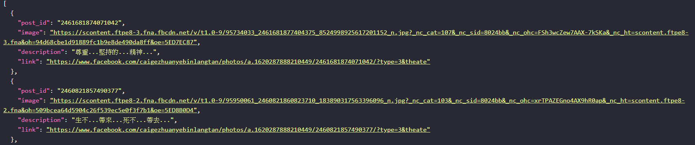

# 財哥語錄 API
擷取 [財哥專業檳榔攤](https://www.facebook.com/caigezhuanyebinlangtan) 的 [動態時報相片](https://www.facebook.com/caigezhuanyebinlangtan/media_set/?set=a.1620287888210449) 內語錄的圖片、說明以及貼文連結、ID  並存入 MySQL 資料庫  
**這個 API 並不需要 Facebook 開發人員帳號及申請應用程式驗證**  

## 系統需求
- PHP 7.0 以上，開發環境為 PHP 7.1.18
- MySQL 資料庫
- [Composer](https://getcomposer.org/)

## 安裝
- 將 `zack.sql` 匯入資料庫
- 使用 `composer install` 安裝套件
- 設定 `config.php`

## 使用
- `index.php` 為 API 網址
- 可設定排程執行 `cornjob.php`，抓取相簿圖片並存入資料庫，執行時間約 15 到 20 分鐘

## 欄位說明
- `post_id`: 貼文 ID
- `image`: 圖片網址
- `description`: 圖片說明
- `link`: 貼文網址

## 連結
- [API 網址](https://api.kento520.tw/zack/index.php)